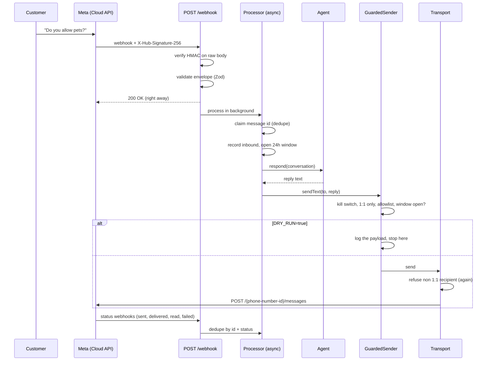

# whatsapp-agent-kit

A small TypeScript server for running an AI agent on the WhatsApp Cloud API without hurting your number.

It handles the boring parts that break in production: signed webhooks, duplicate deliveries, the 24-hour window, group chats, and a way to turn the bot off fast. The agent itself is a plug-in. Bring your own, or use the demo one.

## Why this exists

I have run WhatsApp agents in production for real customers. The model was rarely the problem. These were:

- **A bot replied in a group.** Someone added the business number to a group chat. The bot treated it like a 1:1 conversation and answered everyone. Nothing in the code said "never send to a group", so nothing stopped it.
- **A line got flagged for review after cold outreach.** A script sent free-form messages to people who had not written first. Users blocked and reported it. Meta lowered the number's quality rating and put it under review. That number was the main sales channel.
- **Meta rejected messages outside the 24-hour window.** An agent tried to follow up a day later with plain text. The API accepted the request, then the message failed later with a status webhook (error 131047). The customer never got it, and nobody noticed for days.
- **The same message arrived twice.** Meta delivers webhooks at least once. Without dedupe, the customer got two answers, and the second one was sometimes different.

Each rule in this kit comes from one of those. They are enforced in code, with tests, so a future change (or a prompt-injected agent) cannot skip them.

## How a message flows



## Quickstart

You need Node 20+ to run it and Node 22.12+ for the test suite.

```bash
git clone https://github.com/fechegarzon/whatsapp-agent-kit
cd whatsapp-agent-kit
npm install
cp .env.example .env    # set WHATSAPP_APP_SECRET and WHATSAPP_VERIFY_TOKEN

npm test                # 67 tests, no network
npm run dev             # starts on :3000
```

Try it without a WhatsApp number. In another terminal:

```bash
export WHATSAPP_APP_SECRET=...   # same value as in .env
npm run simulate -- "what are your office hours?"
```

The script signs a fake inbound message the same way Meta does and posts it to your server. With the defaults (`AGENT_ENABLED=false`), the server logs the message and stays quiet. Set `AGENT_ENABLED=true` and keep `DRY_RUN=true` to see the reply it *would* send:

```json
{"level":"info","msg":"dry_run.would_send","to":"15***0123","kind":"text","body":{"messaging_product":"whatsapp","recipient_type":"individual","to":"15***0123","type":"text","text":{"body":"The leasing office is open Monday to Friday, 9am to 6pm.","preview_url":false},"context":{"message_id":"wamid.sim.1791160674369"}}}
```

To go live, point your Meta app's webhook to `https://your-host/webhook`, use your `WHATSAPP_VERIFY_TOKEN`, and subscribe to the `messages` field. Then fill in the access token and phone number id, add your own number to `OUTBOUND_ALLOWLIST`, and set `DRY_RUN=false`. Remove the allowlist when you trust it.

## Environment variables

| Variable | Required | Default | What it does |
| --- | --- | --- | --- |
| `WHATSAPP_APP_SECRET` | yes | | App secret from your Meta app. Used to check `X-Hub-Signature-256`. |
| `WHATSAPP_VERIFY_TOKEN` | yes | | Any string. Meta sends it back when you register the webhook. |
| `WHATSAPP_ACCESS_TOKEN` | when `DRY_RUN=false` | | System user token with `whatsapp_business_messaging`. |
| `WHATSAPP_PHONE_NUMBER_ID` | when `DRY_RUN=false` | | The sending number's id (not the phone number itself). |
| `GRAPH_API_VERSION` | no | `v23.0` | Graph API version in the send URL. |
| `AGENT_ENABLED` | no | `false` | Kill switch. When `false`, messages are recorded but nothing is ever sent. |
| `DRY_RUN` | no | `true` | Run everything, log the outbound payload, never call Meta. |
| `OUTBOUND_ALLOWLIST` | no | empty | Comma-separated wa_ids. When set, only these numbers can receive messages. |
| `ANTHROPIC_API_KEY` | no | | If set, a Claude-backed agent replaces the FAQ demo agent. |
| `ANTHROPIC_MODEL` | no | `claude-opus-5-5` | Model for the Claude agent. |
| `PORT` | no | `3000` | HTTP port. |
| `LOG_LEVEL` | no | `info` | `debug`, `info`, `warn` or `error`. |

The config is validated with Zod at boot. A bad value stops the process before it receives a single message.

## Design decisions

**Verify the signature on the raw bytes.** The HMAC covers the body exactly as Meta sent it. If you parse the JSON first and re-serialize it, the check fails. The compare uses `crypto.timingSafeEqual`. The GET verify token is compared the same way.

**Answer 200 first, work later.** Meta wants a fast 200 and retries if it does not get one. An LLM call can take longer than that, and a retry means a duplicate. The webhook returns right away and the work runs in a tracked background queue. On `SIGTERM` the server waits for that queue to finish.

**Validate in two passes.** Meta sends several messages in one POST. The envelope is checked first, with just enough per message to route it. Then each message is parsed alone with a Zod discriminated union (text, interactive button/list reply, button, audio, image, document). An unknown type or a broken message is logged and skipped. The rest of the batch still goes through. All objects use `z.looseObject` (Zod 4's passthrough), so a new field from Meta never breaks parsing.

**Authentic but odd payloads get a 200.** If the signature is valid but the shape is wrong, the request did come from Meta. Returning 4xx would only make Meta retry it for days. It gets logged instead.

**Dedupe with claim and release.** Each message id is claimed in an `IdempotencyStore` before any work. Statuses use `id + status` as the key, because `sent`, `delivered` and `read` share one id. If processing crashes, the key is released so a redelivery can retry. If a safety rule refuses the send, the key is kept: that was a decision, not a failure. The default store is in memory. `RedisIdempotencyStore` works with any client that can do `SET NX PX` (wiring examples for node-redis and ioredis are in the source).

**The 24-hour window uses Meta's timestamp.** Not the time we received the webhook. A webhook replayed hours after an outage must not reopen a closed window. The window also closes 5 minutes early to absorb clock skew and send latency. Outside the window, `sendText` throws `WindowClosedError` before any HTTP call. The only way out is `sendTemplate`, with a payload from `buildTemplate()`. The builder checks that placeholders run `{{1}}, {{2}}, ...` with no gaps, that the parameter count matches, and that no parameter is empty or has the new lines, tabs or long runs of spaces Meta rejects.

**Every refusal is a typed error.** `AgentDisabledError`, `GroupRecipientError`, `NotAllowlistedError`, `WindowClosedError` and `TemplateValidationError` all extend `OutboundError` and carry a `code`. Callers can switch on it: queue a template, alert a person, or drop the reply.

**Group blocking lives in the transport.** The sender checks the recipient, and so does `GraphApiTransport`, right before `fetch`. A 1:1 recipient must be a plain wa_id: digits only, no `+`, no `@g.us`, no group id. The request body always sets `recipient_type: "individual"`. Inbound messages with a `group_id` never reach the agent.

**Two switches, not one.** `AGENT_ENABLED` is the kill switch: nothing leaves, ever. `DRY_RUN` is rehearsal: the full pipeline runs, including the window and group checks, and the exact payload is logged. They are independent, and both default to the safe side.

**The agent cannot send.** An agent only implements `respond(conversation) -> reply | null`. It never gets the transport. A buggy or prompt-injected agent can write a bad reply, but it cannot pick the recipient or skip a rule. The demo `FaqAgent` is deterministic. `AnthropicAgent` is used only when `ANTHROPIC_API_KEY` is set. It returns `null` on a refusal so a person can take over.

**Logs mask phone numbers.** `15555550123` is logged as `15***0123`. Enough to debug, not enough to leak.

## Project layout

```
src/
  app.ts                  Hono routes: GET/POST /webhook, /healthz
  index.ts                Wiring and graceful shutdown
  config.ts               Env parsing with Zod
  background.ts           Tracked fire-and-forget queue
  webhook/signature.ts    HMAC check, constant-time compare
  webhook/schema.ts       Zod schemas for the webhook payload
  webhook/processor.ts    Dedupe, window, agent, send
  store/idempotency.ts    IdempotencyStore + memory and Redis adapters
  store/service-window.ts 24-hour window tracking
  outbound/sender.ts      GuardedSender: all the rules in one place
  outbound/transport.ts   Graph API client + 1:1 recipient guard
  outbound/templates.ts   Template builder and checks
  agent/                  Agent interface, FAQ demo, Claude agent
test/                     Vitest suites (no network)
scripts/simulate-inbound.ts
```

## What's next

- Durable stores (Postgres or Redis) for the window and conversation history.
- Per-contact ordering, so two quick messages from one person are answered in order.
- Opt-out handling ("STOP") that blocks templates too.
- A human handoff mode that pauses the agent for one conversation.
- Media download and transcription for voice notes.
- Alerting on failed statuses and on the number's quality rating.

## More

This is one piece of a larger write-up on running AI systems in production: [github.com/fechegarzon/ai-systems-in-production](https://github.com/fechegarzon/ai-systems-in-production).

## License

MIT. See [LICENSE](LICENSE).
